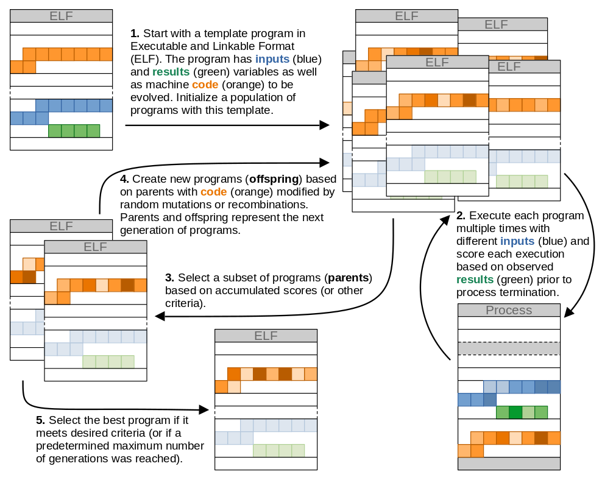

# Viaevo - genetic programming via random changes at machine code level

Viaevo implements a genetic programming[^Koza1994] framework to evolve programs in [Executable and Linkable Format (ELF)](https://en.wikipedia.org/wiki/Executable_and_Linkable_Format) by making changes to their machine code. Viaevo revisits a previous idea[^Kuehling2002] where the changes made to the evolvable machine code are __*random*__ (e.g. a random bit flip in machine code from a parent or random a recombination/crossover of machine code from two parents). This provides an unrestricted access to the search space and could accelerate the evolution process by avoiding building programs from source code or guaranteeing program validity and consistency across generations. However, random changes inevitably lead to invalid code since for e.g. the x86 ISA there are about 1.3×1036 possible instructions[^Domas2017] with only a tiny fraction being valid. Generation of invalid instructions may thus be a hindrance to the speed of the evolution process compared to genetic programming approaches that operate at source-code level program representations, use program modifications from a small finite set, and/or require all programs in a population to be valid[^Nordin1999] [^Koza2005] [^Orlov2009] [^LeGoues2012] [^Schkufza2013] [^Langdon2015].

Viaevo intends to reexamine the feasibility of genetic programming via random changes to machine code. The workflow (figure below) starts with a population template ELF programs containing `inputs` and `results` global variables and machine code to be evolved (in this case the `main` function). The workflow proceeds through rounds of program executions, scoring, selection of parents and generation of offspring programs. Executed programs are terminated after reaching the `main` function and upon triggering a signal (which could indicate an invalid state) or a system call. The `results` variable of the process is examined prior to termination and used for scoring. The workflow is outlined in more detail in the [Methods](#methods) section below.

> **_WARNING:_** The evolution produces invalid executables. To protect your system, ***always run these programs in a sandbox!*** When using the [bazel](https://bazel.build/) build system on Linux, this is achieved by default via `build --spawn_strategy=linux-sandbox` in the [.bazelrc](.bazelrc) file. There are other safeguards in place (such as restricting system calls the evolved programs' processes can make and terminating the processes on any signal or system call once the evolved code is reached), but the evolved programs may still exhibit unwanted behavior.

## Methods

### Template programs

The template programs ([elfs/](elfs/)) contain global variables `inputs` and `results` and the `main` function to be evolved. The `main` function contains `nop` (no operation) instructions along with other operations. The “simple” template programs contain only assignments between `dummy` variables and unconditional jumps (in addition to `nop` instructions). The “intermediate” programs also contains additional operations such as arithmetic operations, conditional statements or loops (involving only `dummy` variables). The size of the evolvable machine code (the `main` function) in the template program ELF files was 3,300 bytes (with Gentoo Linux kernel version 6.1.19 and gcc compiler version 12.2.1 20230121). The evolvable code of all programs can be set to all `nop` instructions at the start of the evolution. There are no instructions or operations in the template programs that access or modify the `inputs` or `results` variables.

### Execution of evolved programs

The population of ELF programs is held and modified in memory ([program/program.h](program/program.h)). The modifications carried out on these are changes to the evolvable code (the `main` function) between generations and updating the `inputs` variable between individual executions of the program (figure above). Executed programs are traced using [ptrace](https://man7.org/linux/man-pages/man2/ptrace.2.html). Prior to process termination, the `results` variable is examined in the process memory and used for downstream scoring. Processes are terminated after reaching the evolvable code (the `main` function) and upon triggering any system call (to prevent any unwanted changes to the system) or signal (which may be indicative of an invalid state). Executed programs are also terminated after a predetermined timeout of 50 ms (if e.g. an infinite loop is introduced into the program). To further protect the system from unwanted behavior of an evolved program, the set of allowed system calls for the executed programs is restricted to an essential minimum via [libseccomp](https://github.com/seccomp/libseccomp). Additionally, the entire framework runs in a sandbox (via `build --spawn_strategy=linux-sandbox` in [.bazelrc](.bazelrc)).

### Genetic programming workflow

The implemented genetic programming approach is largely *ad hoc* and is based on a (µ + λ) genetic algorithm[^Forrest1993] [^Ye2020] [^Katoch2021]. Each generation consists of µ + λ programs (figure above). After the execution of all programs within a generation, µ programs are selected as parents. A total of µ - φ parents are selected based on an objective function score and φ parents are selected from the remaining programs at random. A random selection of a subset of parents is loosely inspired by evolution strategies with stochastic ranking[^Runarsson2000]. A total of λ offspring programs are created from µ parents after each generation. Offspring’s evolvable code is created by either a mutation in evolvable code from a randomly selected parent or by a recombination of a part of evolvable code from one randomly selected parent into code from a second randomly selected parent.

There are two types of mutations. The first mutation is a bit flip in a random position of the evolvable code ([MutatorPointRandom](mutator/mutator_point_random.h)). The second mutation is a bit flip in a random position within 15 bytes of the last instruction ([MutatorPointLastInstruction](mutator/mutator_point_last_instruction.h)) - if this lies within the evolvable code, reverting to the first mutation otherwise. It is assumed that the last instruction may have caused an invalid state before the termination and random changes in this last instruction may make the instruction valid. The length of 15 bytes is chosen as the maximum length of an instruction on x86-64 architecture is 15 bytes (https://wiki.osdev.org/X86-64_Instruction_Encoding#General_Overview).

There are two types of recombinations. The first recombination copies a random number of bytes from evolvable code of one randomly selected parent program into a random position of code from a second randomly selected parent program ([MutatorRecombineRandom](mutator/mutator_recombine_random.h)). The copied code segment is trimmed if necessary not to exceed the evolvable code size in the destination code. The second recombination is similar, except the source of the copied code segment is not a parent program but the original starting template program ([MutatorRecombinePlainElf](mutator/mutator_recombine_plain_elf.h)).

Each program within a generation is executed multiple times (figure above) with different inputs (if applicable). Objective function scores are accumulated across all executions for the downstream selection of parents. All trial runs were performed with µ = 60, φ = 10, and λ = 140 (with a resulting program population size of 200).

## Results

> **_NOTE:_** This is still a work in progress.

### Simple programs

### Handwritten digit recognition

## Examples

| Example | Description |
| ------- | ----------- |
| [000_guess_value](examples/000_guess_value/README.md) | Evolves programs that assign a specified value to the `results[1]` global variable. |
| [001_copy_value](examples/001_copy_value/README.md) | Evolves programs that copy the value from `inputs[0]` (or any other element in inputs if the value is present in this array in multiple copies) to the `results[1]` global variable. |
| 002_double_value | Evolves programs that double the value from `inputs[0]` (or any other element in inputs if the value is present in this array in multiple copies) and assign it to the `results[1]` global variable. |
| 010_sum_two | Evolves programs that sum the values from `inputs[0]` and `inputs[1]` (or other elements in inputs if the values are present in this array in multiple copies) and assign the sum to the `results[1]` global variable. |
| [100_mnist_digits](examples/100_mnist_digits/README.md) | Handwritten digit recognition using the [MNIST database of handwritten digits](http://yann.lecun.com/exdb/mnist/). The training (and test) data are not a part of this repo and need to be [downloaded separately](examples/100_mnist_digits/data/README.md). |

## References

[^Koza1994]: Koza, J. R. Genetic programming as a means for programming computers by natural selection. Stat Comput 4, (1994). https://doi.org/10.1007/BF00175355

[^Kuehling2002]: Kühling, F., Wolff, K. & Nordin, P. A Brute-Force Approac to Automatic Induction of Machine Code on CISC Architectures. in Genetic Programming (eds. Foster, J. A., Lutton, E., Miller, J., Ryan, C. & Tettamanzi, A.) vol. 2278 288–297 (Springer Berlin Heidelberg, 2002). https://doi.org/10.1007/3-540-45984-7_28

[^Domas2017]: Domas, C. Breaking the x86 ISA. Black Hat (2017). https://www.blackhat.com/docs/us-17/wednesday/us-17-Domas-Breaking-The-x86-ISA-wp.pdf

[^Nordin1999]: Nordin, P., Banzhaf, W. & Francone, F. Efficient Evolution of Machine Code for CISC Architectures Using Instruction Blocks and Homologous Crossover. in Advances in Genetic Programming (eds. Spector, L., Langdon, W. B., O’Reilly, U.-M. & Angeline, P. J.) (The MIT Press, 1999). https://doi.org/10.7551/mitpress/1110.003.0017

[^Koza2005]: Koza, J. R. & Poli, R. Genetic Programming. in Search Methodologies (eds. Burke, E. K. & Kendall, G.) 127–164 (Springer US, 2005). https://doi.org/10.1007/0-387-28356-0_5

[^Orlov2009]: Orlov, M. & Sipper, M. Genetic programming in the wild: evolving unrestricted bytecode. in Proceedings of the 11th Annual conference on Genetic and evolutionary computation 1043–1050 (ACM, 2009). https://doi.org/10.1145/1569901.1570042

[^LeGoues2012]: Le Goues, C., Nguyen, T., Forrest, S. & Weimer, W. GenProg: A Generic Method for Automatic Software Repair. IIEEE Trans. Software Eng. 38, 54–72 (2012). https://doi.org/10.1109/TSE.2011.104

[^Schkufza2013]: Schkufza, E., Sharma, R. & Aiken, A. Stochastic superoptimization. SIGARCH Comput. Archit. News 41, 305–316 (2013). https://doi.org/10.1145/2490301.2451150

[^Langdon2015]: Langdon, W. B. & Harman, M. Optimizing Existing Software With Genetic Programming. IEEE Trans. Evol. Computat. 19, 118–135 (2015). https://doi.org/10.1109/TEVC.2013.2281544

[^Forrest1993]: Forrest, S. Genetic Algorithms: Principles of Natural Selection Applied to Computation. Science 261, 872–878 (1993). https://doi.org/10.1126/science.8346439

[^Ye2020]: Ye, F., Wang, H., Doerr, C. & Bäck, T. Benchmarking a (µ + λ) Genetic Algorithm with Configurable Crossover Probability. in Parallel Problem Solving from Nature – PPSN XVI (eds. Bäck, T. et al.) vol. 12270 699–713 (Springer International Publishing, 2020). https://doi.org/10.1007/978-3-030-58115-2_49

[^Katoch2021]: Katoch, S., Chauhan, S. S. & Kumar, V. A review on genetic algorithm: past, present, and future. Multimed Tools Appl 80, 8091–8126 (2021). https://doi.org/10.1007/s11042-020-10139-6

[^Runarsson2000]: Runarsson, T. P. & Xin Yao. Stochastic ranking for constrained evolutionary optimization. IEEE Trans. Evol. Computat. 4, 284–294 (2000). https://doi.org/10.1109/4235.873238